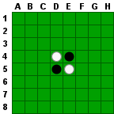
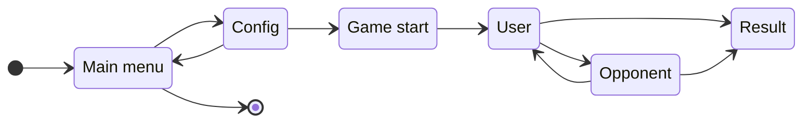
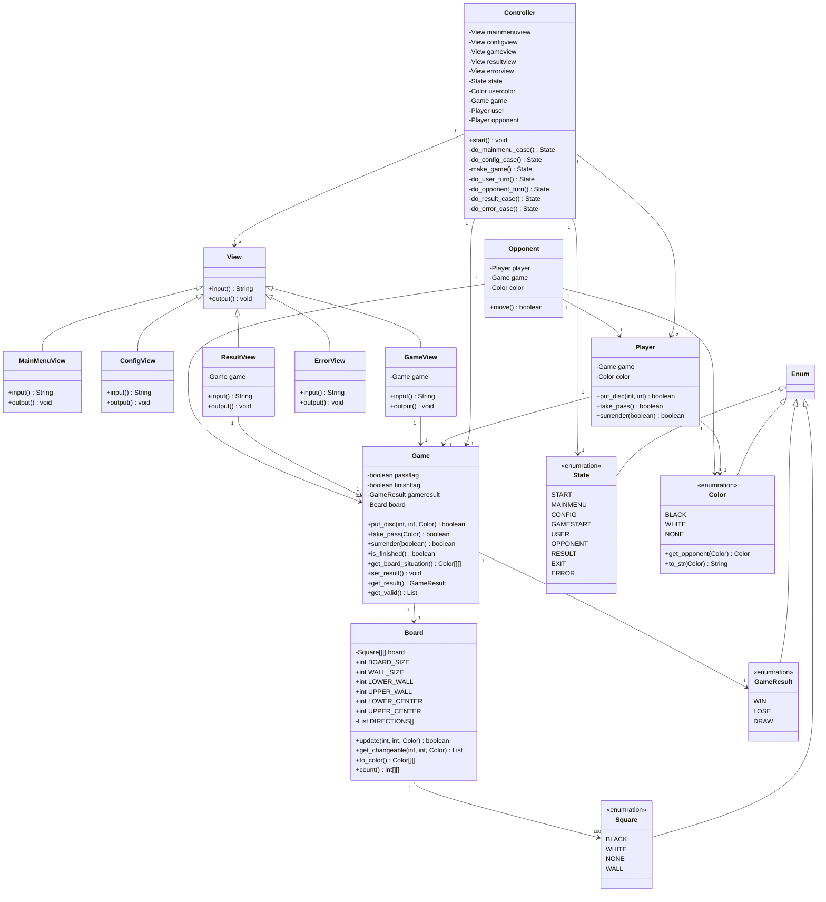

# reversi
This is an implimentation of the reversi game.
Reversi is a two-player strategy game played on an 8x8 board using discs that are colored white on one side and black on the other.
One player plays discs black side up while his opponent plays the discs white side up.

## Rules
### Object of the Game
The object of the game is to place your discs on the board so as to outflank your opponent's discs, flipping them over to your color.
The player who has the most discs on the board at the end of the game wins.

### Rules
Note: For convenience, board positions are denoted by a letter representing the column (A through H) and a number representing the row (1 through 8).

1. Each player chooses a color to play.
1. Every game starts with four discs placed in the center of the board, as shown in Figure1.  
  
1. Although the players choose who goes first in normal rules, the player who chooses black is first in this implementation.
1. Players take turns making moves.
  A move consists of a player a disc of his color on the board.
  The disc must be placed so as to outflank one or more opponent discs, which are then flipped over to the current player's color.  
  Outflanking your opponent means to place your disc such that it traps one or more or your opponent's discs between another disc of your color along a horizontal, vertical or diagonal line through the board square.
1. If a player cannot make a legal move, he forfeits his turn and the other player moves again (this is also known as passing a turn).
  Note that a player may not forfeit his turn voluntarily.
  If a player can make a legal move on his turn, he must do so.
1. The game ends when neither player can make a legal move.
  This includes when there are no more empty squares on the board or if one player has flipped over all of opponent's discs (a situation commonly known as a wipeout).
1. The player with the most discs of his color on the board at the end of the game wins.
  The game is a draw if both players have the same number of discs.

Note: When making a move, you may outflank your opponent's discs in more than one direction, All outflanked discs are flipped.

## Usecases
### Start a new game
1. start this game application.
1. choose "NEW GAME".
1. choose your disc's color.
  If you choose black, you are first.
  Otherwise, your opponent is first.
1. indicate game board in the application window where there are four discs in the center of the board.
  Then a new game gets started.

### Moving a game
1. The black player is first.
   He places a disc of his color in a square where this disc can outflankes one or more his opponent's discs.
   To place a disc is to choose a square in which he wants to place his disc.
   Then his turn has finshed.
1. Next, the white player places a disc and his turn has finished.
   If there is no square in which he can place a disc, his turn is passed and his opponent's turn comes.
1. Repeat the above steps until the game has finished

## Required functions
1. game mode select function:
  Player can select a playing mode where there are new game mode and exit mode.
1. playing config function:
  Player can choose a color he plays before a new game starts.
1. reversi game function:
  Player can play reversi game.
1. auto playing opponent function:
  Player can play reversi games with a opponent who automatically plays it controlled by a software engine.

## State diagram

1. Main menu:  
  Firstly, contents of main menu screen are displayed.
  There are new game and exit in the contents.
  The user can choose an item from them.
  If he chooses new game, the state is changed to Config.
  If he chooses exit, this application is finished.
1. Config:  
  Config screen is displayed.
  The user can choose color he plays in a game.
  Then, he can choose Game Start or Cancel.
  If he chooses Game Start, the state is changed to Game start.
  If he chooses Cancel, the state is changed to Main menu.
1. Game start:  
  A new game gets started and game screen is displayed.
  A pass flag is set at off.
  If the user has chosen Black, the state is changed to User.
  If the user has chosen White, the state is changed to Opponent.
1. User:  
  Current board situation is displayed in the screen.
  This turn's color is shown.
  The user can choose an action from putting a disc, pass or surrender(\*).  
  If he chooses putting a disc, a validation is carryed out whether the putting is valid or not.
  If the putting is valid, the board situation is updated and the state is changed to Opponent.
  Otherwise, he is informed that the putting is invalid and the turn returns (\*).  
  If he chooses pass, a validation is carryed out whether there exist any valid squares or not.
  If there exist at least a valid square, he is informed that there exist valid and the turn returns (\*).
  Otherwise, the pass is accepted.
  Then, if the pass flag is off, it turns to on and the state is changed to Opponet.
  If the pass flag is on, the number of discs of both players is counted, the result of the user is saved in a variable game result and the state is changed to Result.  
  If he chooses surrender, the result of the user is saved in the game result and the state is changed to Result.
1. Opponent:  
  As well as the state of User, firstly, the current board situation is displayed in the screen.
  This turn's color is shown and a message saying the opponent player is thinking now is also shown.
  The opponent player finds valid squares on the board and how many discs are flipped over at each of them.
  He chooses the one having the highest number of flipped over discs and the state is changed to User.
  If there is no valid square, he passes this turn.
  Then, if the pass flag is off, it turns to on and the state is changed to User.
  If it is on, the number of discs of both players is counted, the result of the user is saved in a variable game result and the state is changed to Result.
1. Result:  
  The result screen is displayed and the game result is shown according to the value of the game result.
  The user can choose OK and then the state is changed to Main menu.

## Class diagram

## Referrence
- [Reversi Rules](https://documentation.help/Reversi-Rules/rules.htm)
